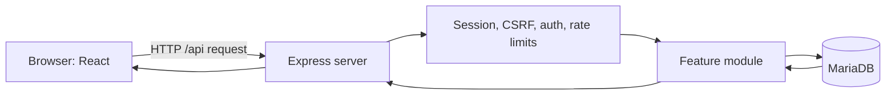
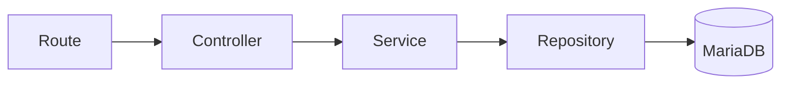

# OMDN Codebase Guide for Junior Developers

This document explains what the OMDN application currently does, how its pieces work together, and where to look when something goes wrong. It describes the code that exists now. Planned changes are called out separately.

## 1. The application in one minute

OMDN is one application with three main parts:

1. A React frontend runs in the browser and displays pages.
2. An Express backend receives API requests, applies security rules, and runs application logic.
3. MariaDB permanently stores users, sessions, permissions, security tokens, rate limits, and audit events.

During development, `npm run dev` starts one Express process. Vite runs inside
it as development middleware, so page loaders, `/api` requests, HMR, and SSR
all share the same origin and request context. Node watches server and framework
configuration files for backend restarts, while Vite handles frontend changes
through HMR. The watcher deliberately excludes generated dependency caches.

In production, `npm start` first builds React Router's SPA output into `build/client`. Express then serves both the built frontend and the API from one process.



## 2. What is implemented and what is not

Currently implemented:

- Basic registration, email verification, login, logout, and admin pages
- Server-side sessions stored in MariaDB
- Roles and permissions
- Password recovery and password changes on the backend
- TOTP setup, QR-code generation, login verification, recovery codes, and disabling TOTP
- CSRF protection
- Persistent rate limiting
- Authentication audit events and an outbox worker
- Soft account deletion and permanent cleanup after one year
- Unit, integration, browser, and real-database smoke tests

Not yet implemented as a complete user interface:

- Password recovery and account management screens
- The blog/post system
- Server-side rendering (SSR)
- The final design system

The files under `src/components/ui/` are an offline shadcn reference library. They are not the final UI architecture and do not need to influence current backend work.

## 3. Important folders

| Path                  | Responsibility                                 |
| --------------------- | ---------------------------------------------- |
| `src/`                | Code that runs in the browser                  |
| `src/pages/`          | Page components such as login and registration |
| `src/api/`            | Browser-to-backend API calls                   |
| `src/routes.js`       | Maps URLs to React Router Framework modules    |
| `src/routes/`         | Framework route modules for individual pages   |
| `src/components/ui/`  | Offline shadcn reference components            |
| `server/`             | Code that runs in Node.js                      |
| `server/application/` | Process services and worker lifecycle          |
| `server/modules/`     | Business features grouped by domain            |
| `server/middleware/`  | Rules applied to many requests                 |
| `server/database/`    | SQL migrations and seed data                   |
| `scripts/dev/`        | Maintenance, diagram, and smoke-test scripts   |
| `tests/e2e/`          | Playwright browser tests                       |
| `docs/`               | Architecture decisions and generated diagrams  |

Frontend imports beginning with `@/` point to `src/`. Backend imports beginning with `#server/` point to `server/`.

## 4. How the server starts

The entry point is `server/server.js`.

It performs these steps in order:

1. `serverConfig.js` reads and validates environment variables with Zod.
2. `createApplication.js` creates the MariaDB pool and process-level services.
3. `expressApp.js` composes the Express middleware and routes without listening.
4. `createWorkerLifecycle.js` groups the current background workers.
5. The worker lifecycle starts both workers.
6. Express starts listening on the configured port.
7. Shutdown handlers are registered for `SIGINT` and `SIGTERM`.

This separation matters because tests and the future React Router handler can
construct the complete HTTP application without opening a port. Only
`server.js`, the process entry point, is allowed to call `app.listen()`.

The program refuses to start if required configuration is missing or invalid. This is intentional: discovering a bad secret or database setting during startup is safer than discovering it during a real request.

When the process stops, `server/shutdown.js`:

1. Stops accepting HTTP traffic.
2. Drains pending audit-event writes.
3. Stops all registered background workers through the worker lifecycle.
4. Closes the session store.
5. Closes the database pool.

An eight-second deadline prevents a broken dependency from keeping the process alive forever.

## 5. The Express request pipeline

Middleware is code that runs before or after a route handler. Its order matters. `server/expressApp.js` installs the main pipeline in this order:

1. Configure proxy trust in production.
2. Add a correlation ID to every request.
3. Add baseline browser security headers to every response.
4. In production, serve static files and fingerprinted assets.
5. Parse JSON only for `/api` requests.
6. Load MariaDB sessions only for `/api` requests.
7. Require CSRF protection for unsafe `/api` methods.
8. Mount authentication, account, and admin feature routes.
9. Mount generic API routes and the API 404 response.
10. Hand non-API page requests to the frontend boundary.
11. Handle unexpected API errors last.

The placement of static files is important: requesting JavaScript, CSS, an
image, or the favicon does not need user identity and must not query the session
table. The JSON parser is also API-only, so an unusual body on a page request
cannot produce an API parsing error.

The active headers prevent MIME sniffing and framing, restrict browser features,
and define a safe referrer policy. Production also enables HSTS. Content
Security Policy comes with SSR because React Router's generated inline scripts
need a fresh nonce for each response; permanently allowing arbitrary inline
scripts would weaken the protection.

A request can stop at any layer. For example, an admin request with no session returns `401` before it reaches the admin controller.

### Correlation IDs

Each request receives an `x-correlation-id`. Unexpected API errors are logged with that ID, and the response returns the same ID. A user can report the ID without seeing internal error details.

### Framework request context

React Router loaders and actions need server information, but they must not
reach into global variables or receive the raw database pool. The files under
`server/framework/` define a small, explicit bridge.

For every page request, Express creates a new `RouterContextProvider` containing:

- An allow-list of services that routes are permitted to call
- Either an immutable authenticated principal or `{ authenticated: false }`
- The request correlation ID
- A clock object, which tests can replace with a fixed time

The provider and its principal snapshot are recreated for each request. This is
important: reusing one provider could expose one user's identity to another
request. Session middleware, workers, the rate-limit store, and the MariaDB pool
are deliberately absent from this context.

### Common HTTP statuses

| Status | Meaning in this application                                                   |
| ------ | ----------------------------------------------------------------------------- |
| `200`  | The operation completed                                                       |
| `202`  | The request was accepted, but another step is required or deliberately hidden |
| `400`  | The submitted data or token is invalid                                        |
| `401`  | The caller is not authenticated                                               |
| `403`  | The caller is known but not allowed, or a security check failed               |
| `404`  | The API route does not exist                                                  |
| `429`  | Too many attempts were made                                                   |
| `500`  | An unexpected server error occurred                                           |

## 6. Sessions: how login remains remembered

The browser receives a cookie named `omdn_session`. The cookie contains a signed, opaque session identifier—not the user object, roles, or permissions.

The matching session data is stored in MariaDB's `sessions` table. After login,
it contains a `userId`, authentication/activity timestamps, the absolute
deadline, and the selected remember-me policy. The server enforces a six-hour
idle timeout and a 24-hour absolute lifetime, or 30 days when the user
deliberately selects “Remember me.” Activity refreshes the idle deadline but
never extends the absolute deadline. Sessions created before this metadata
existed are rejected and must log in again.

Cookie security settings:

- `HttpOnly`: browser JavaScript cannot read the session cookie.
- `SameSite=Lax`: reduces cross-site cookie sending.
- `Secure` in production: the browser sends it only over HTTPS.
- Signed with `SESSION_SECRET`: tampering invalidates it.

MariaDB remains authoritative. A session cookie alone is not enough: protected requests use `requireAuth`, which loads the current user, roles, and permissions from the database. This means a disabled user or changed permission takes effect without waiting for the session to expire.

This database check has a cost, but it prevents stale authorization. A future cache can reduce repeated work, provided invalidation remains correct.

## 7. CSRF protection

CSRF means another website tricks a logged-in browser into sending an unwanted request. Cookies are attached automatically by browsers, so the session cookie alone cannot prove that the OMDN frontend created a request.

For every state-changing API method (`POST`, `PUT`, `PATCH`, or `DELETE`):

1. The frontend calls `GET /api/auth/csrf` if it has no cached token.
2. Express creates a random token and stores it inside the current session.
3. The frontend sends the token in `X-CSRF-Token`.
4. Express compares the supplied and stored tokens using a timing-safe comparison.
5. Express also evaluates browser source information (`Sec-Fetch-Site`, `Origin`, and `Referer`).
6. A missing, invalid, or cross-site request receives `403` and `CSRF_TOKEN_INVALID`.

`src/api/authApi.js` performs this automatically. If the session changes and a cached token becomes stale, it fetches a fresh token and retries once.

Do not call an unsafe endpoint directly with `fetch` unless you deliberately reproduce this behavior. Prefer the shared API client.

## 8. Backend architecture: route, controller, service, repository

Most features use four layers:



- **Route:** declares the URL, HTTP method, middleware, and controller.
- **Controller:** translates HTTP input into a service call and the result into an HTTP response.
- **Service:** contains business rules and coordinates a use case.
- **Repository:** contains SQL and database-specific behavior.
- **Module:** constructs these pieces and supplies their dependencies.

For example, registration is assembled by `registrationModule.js`, exposed by `registrationRoutes.js`, translated by `registerController.js`, decided by `registerService.js`, and stored through `registrationRepository.js`.

This separation makes business logic testable without running the entire server. It also avoids placing SQL, HTTP details, and business decisions in one large function.

### Dependency injection

Services receive repositories and helpers as arguments rather than importing a global database. This is called dependency injection. Tests can supply small fake dependencies, and production supplies real ones in each `*Module.js` file.

### Transactions

A database transaction makes several related changes succeed or fail as one unit.

Typical structure:

```js
await connection.beginTransaction();

try {
	// related database writes
	await connection.commit();
} catch (error) {
	await connection.rollback();
	throw error;
}
```

All repository calls in that transaction must use the same connection. `withConnection.js` obtains and releases it safely.

## 9. Authentication flows

### Registration and email verification

Registration:

1. CSRF and registration rate-limit middleware run.
2. Zod validates the display name, email, and password.
3. The service checks whether the normalized email already exists.
4. Argon2id hashes the password. Plain-text passwords are never stored.
5. A random verification token is created.
6. Only the token's SHA-256 hash is stored.
7. In one transaction, a pending user is created, the subscriber role is assigned, and the verification record is stored.
8. After the transaction commits, the mail service sends the raw token in a verification link through SMTP.
9. The API returns a deliberately generic `202` response so account existence is harder to discover.

The raw token exists only long enough to construct the message; the database
stores its hash. Resending invalidates the previous unused token and delivers a
new one. SMTP is configured with `PUBLIC_BASE_URL` and the `SMTP_*` environment
variables. When SMTP is disabled in development, the same mail service prints
the verification token so the real smoke test and manual testing still work.
Mail is sent after the database commit, so a temporary SMTP failure does not
undo the pending account. The user can use resend; a future durable mail outbox
will provide automatic retries.

Verification hashes the submitted token, locks and checks the database record, activates the user, marks verification tokens used, and commits everything together.

### Login without TOTP

1. The login rate limiter runs.
2. The service finds the identity by normalized email.
3. Argon2 verifies the password hash.
4. Pending, disabled, and deleted accounts are rejected.
5. If TOTP is disabled, the session is regenerated to prevent session fixation.
6. `userId` is stored in the new session.
7. The chosen 24-hour or 30-day absolute deadline is stored.
8. `last_login_at` is updated without removing sessions on other devices.

The current policy permits several authenticated devices. Each session has its
own idle and absolute deadlines.

### Login with TOTP

After a correct password, an account with TOTP enabled is not fully authenticated. The server stores temporary pending-login state in the session and returns `200` with `authenticationState: "totp_required"`, the challenge expiry, and the number of remaining attempts. The pending state is deliberately not an authenticated principal, so private loaders continue to redirect it to `/login`.

The client must then submit a six-digit TOTP or recovery code to `/api/auth/totp/login/verify`. A valid second factor completes the session. TOTP time steps are recorded so the same time-based code cannot be replayed. Recovery codes are hashed in the database and are single-use.

The login page detects that explicit state and replaces the password form with a basic authenticator-or-recovery-code form. Successful verification creates the authenticated session, asks the shared TanStack Query cache to load `/api/account/me`, and navigates administrators to `/admin`. Invalid codes keep the challenge visible while attempts remain; an expired or exhausted challenge returns the page to the password form.

### TOTP setup

1. The backend generates an authenticator secret.
2. It creates an `otpauth://` URI for “O Melhor do Natal”.
3. `qrcode` converts the URI into a QR-code data URL.
4. The secret is encrypted with AES-256-GCM before storage.
5. Encryption binds the secret to the user ID through additional authenticated data.
6. The user scans the QR code and submits the current code.
7. Successful verification enables TOTP and returns new recovery codes once.

The protected `/account/security` skeleton implements this flow. It displays
the QR code and manual secret, confirms setup, shows recovery codes once, and
provides basic regeneration and disable forms. It intentionally has no final
design yet. Administrators can reach it from `/admin`; authenticated users
without admin permission are sent there after login.

`TOTP_ENCRYPTION_KEY` must be a Base64 encoding of exactly 32 random bytes. It must not be exposed through a `VITE_*` variable.

### Password recovery and change

Forgot-password responses do not reveal whether an email exists. Reset tokens are random; only their hashes are stored. A successful reset changes the password, consumes reset tokens, and deletes all existing sessions in one transaction.

An authenticated password change verifies the current password, updates the
hash, and revokes every session—including the current one—so the user must log
in again. Password reset and account deletion also revoke every session. TOTP
enable, disable, and recovery-code regeneration preserve the current session
but revoke every other device.

### Logout

Logout destroys the server-side session and clears the browser cookie. The frontend also forgets its cached CSRF token and removes private TanStack Query data. Any later API `401` performs the same browser-side cleanup and redirects to `/login`; the backend remains the authority that decides whether the session is valid.

## 10. Authentication versus authorization

These words are related but different:

- **Authentication:** “Who are you?” Answered by the session and `requireAuth`.
- **Authorization:** “May you do this?” Answered by roles, permissions, and `requirePermission`.

Roles group permissions. Users receive roles through `user_roles`; roles receive permissions through `role_permissions`. The admin test endpoint requires `users.manage` rather than checking for a hard-coded role name. Permission checks are more flexible because several roles can eventually share a capability.

The frontend checks permissions to decide where to navigate and what to display. This is only a user-experience decision. The backend always checks permissions again because users can bypass frontend code and call an API directly.

The frontend and backend deliberately do not import one another. Browser pages call functions in `src/api/authApi.js`, and those functions use HTTP requests under `/api/*`. Express receives those requests and forwards them through API middleware and feature modules to services, repositories, and MariaDB. Because an import graph cannot detect a URL string as a code dependency, this runtime connection is shown separately in `docs/diagrams/runtime/overview.svg`.

## 11. Why `/me` exists

`GET /api/account/me` returns the current user, roles, and permissions from the authoritative backend.

The current frontend uses it after login:

- Login loads `/me` through TanStack Query after success to decide whether to navigate to `/admin`.

The private parent loader receives the principal from Express request context,
redirects guests, and seeds the same account query for authenticated browser
components. Its infinite staleness is intentional: mounting the header and page
does not issue duplicate `/me` calls immediately after login. Explicit login,
logout, and authentication-loss transitions update the cache instead. API
middleware still performs authorization independently for protected operations;
cached permissions only control presentation.

## 12. Frontend flow

`src/root.jsx` is the sole HTML document shell in React Router Framework Mode. It owns global CSS, metadata, the favicon, scroll restoration, Framework scripts, the TanStack Query provider, and the last-resort error document. Each root render creates an isolated query client, which prevents one SSR request from sharing private data with another; the hydrated browser retains its client across renders. The public, authentication, and private layouts render `SiteHeader.jsx` above their route outlet, so every normal page uses the same navigation component. The private layout seeds its loader principal into the current-account query, which supplies account links, the signed-in email, and logout; public pages retain guest links without opening a session or calling `/me`. `src/entry.server.jsx` streams that document on the server, while React Router's default client entry hydrates the same markup in the browser and supplies development `StrictMode`. `src/routes.js` maps every URL to a small module in `src/routes/`; each module currently reuses the corresponding page component from `src/pages/`. The old declarative SPA router has been removed, so this Framework configuration is the only frontend route authority.

The account-security page uses the private `['account', 'security', 'totp']`
query for TOTP status. TOTP setup, enable, recovery-code regeneration, and
disable operations use mutations with `gcTime: 0` so codes, passwords, secrets,
and recovery-code responses are not retained in the mutation cache after the
operation. Successful operations update or invalidate only the account-security
prefix.

Public recipe pages use feature-owned keys under `['recipes']`. Numbered archive
pages include the normalized page in their key, detail pages include the slug,
and loader results are used as initial query data for SSR and hydration. The
public `/api/recipes/archive?page=N` endpoint mirrors the crawlable archive
loader contract. Publishing through the admin editor invalidates the recipe
prefix; drafts and scheduled recipes do not invalidate public data immediately.

For a production page request, the current frontend works like this:

- Express serves fingerprinted assets itself and sends document requests to React Router.
- React Router renders complete HTML on the server and streams it to the browser.
- JavaScript loads and hydrates the existing HTML, attaching React behavior without rebuilding a different page.
- Pages call the Express API when they need server data.

### Three kinds of frontend state

“State” simply means information that can change while the application runs.
Not all state has the same owner, so putting all of it in one global store would
make the application harder to reason about.

| Kind of state  | Examples                                                                | Current owner                                   |
| -------------- | ----------------------------------------------------------------------- | ----------------------------------------------- |
| Server state   | Current account, permissions, recipes, paginated posts                  | Backend, with a TanStack Query browser snapshot |
| URL state      | Current page, search text, filters, sorting                             | React Router path and search parameters         |
| Local UI state | Input text, open dialog, submitting flag, temporary TOTP challenge form | React component state                           |

Server state is data the browser does not own. It can become outdated because
another request, browser tab, administrator, or background worker changed the
backend. TanStack Query is designed for this problem. It remembers responses,
shares them between components, tracks whether a request is running or failed,
and gives us explicit ways to refresh or discard data.

Local UI state usually belongs close to the component that uses it. For
example, the characters currently typed into the login password field should
not enter a global cache. URL state belongs in the URL when users should be able
to bookmark, share, refresh, or navigate back to the same view. A recipe-list
page number and filter are good URL state; whether its help popover is open is
not.

This is why adding TanStack Query does not mean every `useState` should be
removed. It also does not mean Zustand is required. Zustand solves shared
client-owned state. We will add it only if a real client-only workflow becomes
too awkward with React state and context.

### What the QueryClient and provider do

`QueryClient` is the object that owns the query cache. A query cache is roughly
a map from a query key to its latest result and status. The
`QueryClientProvider` makes that client available to descendant components
through React context, so those components do not need the client passed through
every intermediate component as a prop.

OMDN creates it in `src/query/ServerStateProvider.jsx`. The lifetime rules are
important:

- A browser keeps one client while the React application is running. Creating a
  new one on every render would erase the cache and cause repeated requests.
- Every SSR render creates a new client. A module-level singleton on the server
  could let one user's private cached account appear in another user's request.
- Public routes do not load the current-account query just to personalize the
  header. This preserves account-independent, cacheable public HTML.

The factory in `src/query/createQueryClient.js` also records shared defaults.
Queries do not retry automatically, do not refetch merely because the browser
window regained focus, and are considered fresh for 30 seconds unless a query
chooses a different policy. Mutations do not retry automatically because
repeating a state-changing request can be unsafe unless that operation was
specifically designed to be idempotent.

### Query keys are cache addresses

Every query needs a stable key. The current account uses:

```js
['account', 'current'];
```

Think of this as the address of that result inside the cache. Components using
the same key share the same data and in-flight request. If two components ask
for the current account at nearly the same time, TanStack Query can reuse one
request instead of sending two `/me` calls. This is request deduplication.

Values that change a response must be represented in its key. A future recipe
list might use:

```js
['recipes', 'list', { page: 2, search: 'cake', status: 'published' }];
```

Page 1 and page 2 are different cache entries. Never place passwords, cookies,
session IDs, TOTP secrets, recovery codes, or other secret material in a query
key. Query keys can appear in developer tools and logs.

### How the current-account query works

`src/query/currentAccountQuery.js` gathers one concern in one place:

1. It defines the stable query key.
2. Its query function calls `getCurrentAccount()` from the HTTP API adapter.
3. It converts a successful response into one predictable frontend shape.
4. It converts `401` into `{ authenticated: false }`.
5. It exposes `useCurrentAccount()` for components.

Normalizing the response means components do not each interpret backend fields
differently. They receive `authenticated`, `user`, `roles`, and `permissions` in
the same shape. The cache deliberately excludes session internals and secret
authentication material.

`useCurrentAccount()` is a React hook. It subscribes the component to that cache
entry, so the component rerenders when the entry changes. `fetchQuery()` is the
imperative equivalent used after login: it loads or reuses the entry and returns
the value so the login code can immediately choose a destination.

### Loaders and TanStack Query have different jobs

It may look redundant that a React Router loader and a query both know the
current account. They serve different moments and different trust levels:

```text
request for /admin
  -> private loader checks the server-side principal
  -> guest is redirected before the private page renders
  -> authenticated principal seeds the browser query cache
  -> header and page subscribe to the shared cached snapshot
```

The loader is a navigation guard. It decides whether a route may render and
works during SSR. TanStack Query distributes the resulting snapshot among
interactive browser components after that decision. Removing the loader would
make protected navigation depend on a later browser request and weaken SSR.
Removing the query would make components pass account data through props or
issue their own duplicate requests.

The account query uses `staleTime: Infinity`. “Stale” does not mean deleted; it
means eligible for an automatic refetch. Infinity tells TanStack Query not to
automatically refetch this snapshot after the private loader or completed login
has just supplied it. Account-changing events must therefore update, invalidate,
or remove it explicitly.

### Updating and clearing cached state

These operations have different meanings:

- `setQueryData` immediately replaces a cached value without making a request.
- `invalidateQueries` marks matching data stale so an active consumer can
  refetch it.
- `removeQueries` deletes matching cache entries entirely.
- `fetchQuery` returns fresh cached data or performs and shares the request.

After logout, OMDN removes queries marked as private and writes the guest account
value before navigating to `/login`. Public content need not be discarded just
because the user logged out. The API adapter also publishes an authentication-
loss event for a `401`; the root cache controller performs the same cleanup and
redirect. This prevents old private presentation data from remaining visible
after the backend has rejected the session.

This cleanup improves user experience, but it is not authorization. Browser
memory is controlled by the user and cached permissions can be old. Every
protected API endpoint must still resolve the session and enforce permissions
in Express.

### What to use for future content

TanStack Query becomes especially useful for interactive administration lists,
load-more feeds, background refresh, and mutations that affect several visible
views. React Router loaders remain a good fit for route-critical public article
HTML and SEO metadata. Do not copy query results into `useState`; that creates a
second snapshot that can disagree with the cache. Keep pagination and filters in
the URL, include their normalized values in the query key, and invalidate only
the affected list/detail keys after a mutation.

SSR is enabled for the Framework application. Public, authentication, and
private route layouts now own cache policy and account-loading boundaries.
Private and authentication document/data requests load the MariaDB session;
public pages do not. This lets the authentication layout redirect an already
authenticated user away from `/login`, `/register`, and `/verify-email` without
adding a browser `/me` call. A pending TOTP challenge is not an authenticated
principal and therefore remains on `/login`. The Express boundary also covers
`/admin`, future nested routes such as `/admin/posts`, `/account/security`, and
their `.data` requests. It deliberately does not match a different public name
such as `/administrator` or unrelated future account pages automatically.

In production, the security middleware creates a new Content Security Policy nonce for every response. It replaces any client-supplied internal nonce header, and the server entry applies that trusted value to React Router's inline scripts. This lets the browser run the generated scripts without allowing arbitrary inline scripts.

### Current page behavior

- `/register` manages form state and displays server validation errors.
- `/verify-email?token=...` submits the verification token once.
- `/login` logs in, fetches the shared current-account query, and navigates administrators to `/admin` or other users to `/account/security`; its parent layout redirects users who are already authenticated.
- `/account/security` exposes the basic TOTP setup and management flow to every authenticated user.
- `/admin` resolves the session and permission in server loaders.
- The shared header provides public navigation everywhere and account navigation plus logout on authenticated private pages.
- `/dev/design-system` exists only in development.
- `/dev/page-examples/recipe` and `/dev/page-examples/gift-ideas` demonstrate how a template can use independently selected layouts, headers, footers, and region blocks. These are in-memory examples rather than database content.

### Dynamic page presentation

React Router layouts define broad security areas such as public, authentication, and private pages. Content presentation adds a separate composition layer inside a public route:

```text
page configuration
  -> allowlisted layout (full width or sidebar)
  -> allowlisted content template (recipe or gift ideas)
  -> allowlisted header and footer variants
  -> allowlisted blocks assigned to regions such as the sidebar
```

`src/presentation/PageRenderer.jsx` performs that composition. The layout controls the available structural regions, while the template renders the content fields. This allows the same recipe template to use different layouts and headers without duplicating the recipe implementation. The trusted registries translate identifiers into components; stored page data must never contain executable JSX, JavaScript, or arbitrary import paths.

The recipe example now also proves a small article-source boundary.
`src/content/recipes/recipeSchema.js` owns the initial recipe JSON schema.
Version 1 includes difficulty and validates and restores revision data, derives plain text for future
search indexing, formats ingredients, and creates schema.org `Recipe` data for
SEO. `RecipeTemplate` accepts only data that passes a supported schema. Stable
IDs on ingredients and instructions let future editors reorder items without
using their visible text as identity. This is intentionally a recipe-only
decision; it does not yet define how arbitrary rich articles will store
galleries, tables, embeds, or other editor content.

`/dev/recipe-editor` adds the shared Tiptap editor for the optional recipe
description. Tiptap is bundled with the editor route from local npm modules;
the stable editor frame avoids swapping through separate loading and textarea
states. The OMDN-owned toolbar exposes only emphasis, lists, and links. When the proof is saved,
React Router sends the whole serialized recipe to its server action. The action
validates its size and recipe schema, sanitizes the HTML with
`sanitize-html`, serializes/restores the revision, and returns the safe preview.
Never render raw editor output before that server boundary. The future database
service must run the same sanitization before persisting an immutable revision.

### Recipe publication is a controlled state machine

A recipe will not be represented by a single database row that anyone can
overwrite and expose immediately. It has an editorial state and immutable
revisions. “Immutable” means an existing revision is never edited in place. A
new save creates a new revision, which preserves history and lets publication
point to an exact known version.

The approved states are:

```text
draft ⇄ in review
draft or in review → scheduled → published ⇄ archived
any non-trashed state → trashed
```

- A **draft** is working content.
- **In review** means an editor has been asked to examine a particular revision.
- **Scheduled** means a particular revision should become public at a future
  time.
- **Published** means a particular revision is currently public.
- **Archived** preserves the post and slug but removes it from public access.
- **Trashed** is a reversible soft deletion before eventual permanent deletion.

The arrows are not merely a diagram for the interface. They describe allowed
domain operations. For example, restoring a trashed recipe returns it to draft;
it must not unexpectedly make an old version public. Editing a published recipe
creates a new working revision while visitors keep seeing the existing published
revision. A scheduled publication also remembers an exact revision, so later
draft edits cannot silently change what the worker publishes.

This pattern is called a **state machine**: the current state and requested
operation determine whether a transition is legal. The service layer enforces
it. An impossible transition returns HTTP `409 Conflict`, while editing an old
version after somebody else saved changes returns `412 Precondition Failed`.

### Recipe roles, permissions, and ownership

A role is a named collection of permissions; a permission is one capability.
Ownership adds another condition. `posts.edit_own` does not mean “edit every
post”—the backend must load the post and verify that its `owner_user_id` matches
the current user. The displayed author is separate and does not grant access.
Permissions ending in `_all` deliberately bypass that ownership restriction.

The initial editorial model behaves like this:

- Administrators can perform every editorial operation, including eligible
  permanent deletion.
- Editors can edit, review, publish, archive, trash, and restore anyone's posts.
- Authors can create and publish their own posts, including scheduling and
  archiving them.
- Contributors can create, edit, and submit their own drafts, but an editor or
  administrator must publish them.
- Subscribers cannot access editorial operations.

Publication uses separate `posts.publish_own` and `posts.publish_all`
permissions. The content-foundation seed replaces the former coarse
`posts.publish` permission and assigns the scoped permissions idempotently.
Content services must still enforce ownership and lifecycle rules; possession of
a permission code alone is not sufficient to authorize a transition.

The browser can use these permissions to hide or disable controls, but requests
remain hostile input. A user can modify JavaScript or call the API manually, so
the backend repeats the capability, ownership, lifecycle, and optimistic-
concurrency checks inside the operation's transaction.

### How the recipe tables will fit together

The approved schema separates identity, editable history, and publication:

```text
users ──→ authors
  │          │
  └──→ posts ┘
         │
         ├──→ post_revisions (immutable history)
         ├──→ post_revision_heads (current/submitted/published pointers)
         ├──→ categories and tags (through join tables)
         ├──→ route_slugs (canonical URL and old redirects)
         └──→ publication_schedules (one exact future revision)
```

`posts` is the stable identity and lifecycle record. It owns fields such as the
status, visibility, owner, displayed author, timestamps, pillar classification,
and optimistic `lock_version`. It does not contain the complete recipe document.

`post_revisions` contains versioned recipe JSON plus useful snapshots such as
the title, excerpt, SEO title/description, focus keyword, and derived plain text.
Saving inserts a row with the next revision number. The repository will
intentionally offer no method that overwrites a revision's source. Keeping SEO
metadata in the revision ensures the HTML title and description correspond to
the exact recipe version visitors are reading.

The revision also stores allowlisted layout, template, header, and footer keys
plus validated region configuration. This is intentional OMDN presentation
data, not copied Astra configuration. Versioning it means the published revision
determines both its content and its approved presentation while the editor can
prepare a different draft layout safely.

`post_revision_heads` is a small one-row-per-post pointer table. It answers
three different questions:

- What is the newest editorial revision?
- Which revision was submitted for review?
- Which revision are visitors currently reading?

Keeping those answers separate is what lets an author edit a published recipe
without changing the public page. Composite foreign keys include both the post
ID and revision ID, preventing a bug from pointing one recipe at another
recipe's revision.

Categories and tags use **join tables** because a recipe can have many of them
and each category/tag can belong to many recipes. This is a many-to-many
relationship. The primary category is also stored on `posts` for efficient
queries, but the service must ensure it is present in `post_categories` within
the same transaction.

`route_slugs` owns URL names in one namespace. A recipe has one canonical slug
and may keep several old slugs as redirects. An old slug points directly to the
resource identity, not to another slug, so changing a name several times does
not create a slow redirect chain.

The separate revision-head table also makes permanent deletion safer. The
transaction deletes the pointer row first, then deletes the post and lets its
revisions cascade. We will prove this order against real MariaDB rather than
assuming that circular foreign-key deletion works.

Indexes are planned around actual access patterns: published feeds order by
`published_at` and ID, administrative lists order by `updated_at` and ID, and
taxonomy joins support lookup from either direction. An index speeds reads but
costs storage and work on every write, so “index every column” is not a useful
strategy.

Creating, editing, publishing, or deleting content spans multiple tables. The
service wraps each operation in one database transaction and writes its audit
and outbox event before committing. This guarantees that readers never observe
half a recipe—for example, a post without its first revision or a published
state without the selected published revision.

### Translating the old WordPress recipe form

An old administration form shows requirements, but its fields do not dictate
our database columns. WordPress plugins often place unrelated values around the
same editor screen. We first ask who owns each value and whether it should be
versioned.

- Recipe title, description, exact preparation/cooking minutes, yield,
  difficulty, ingredients, and instructions belong to immutable recipe JSON.
- The displayed preparation range is derived from exact minutes. Storing only
  “under one hour” would throw away information and make calculations weaker.
- Ingredients and instructions remain structured arrays, not HTML blobs. This
  lets the application validate and reorder them and generate accessible HTML
  and schema.org data reliably.
- Slugs live in the shared slug table because old URLs must redirect safely.
- Ownership and displayed author use foreign keys, not a `submitted_by` text
  field. A name string cannot enforce permissions.
- SEO title and description belong to the immutable revision. A focus keyword
  is an internal writing aid, not a meta tag for search engines.
- Featured images will reference validated media assets. Arbitrary external
  image URLs are not accepted into the first model.
- Rank Math, Content AI, Link Whisper, LiteSpeed, and WordPress editor controls
  are plugin state and are not migrated.
- Intentional OMDN layout/template selections are separate allowlisted
  presentation fields on the revision. They are not recipe source and cannot
  contain executable component paths.

The current recipe proof writes source-schema version 1. Difficulty is required
and limited to `easy`, `medium`, or `hard`. No recipe table or persisted recipe
documents existed before this definition, so there is no older recipe format to
migrate. A version 2 will be introduced only after version 1 data exists and a
real incompatible format change requires it.

References that describe historical actors, such as “created by,” become null
if that user is permanently purged; the recipe history remains. The ownership
foreign key is stricter: account cleanup must explicitly delete the user's owned
content first. This distinction prevents an innocent foreign-key cascade from
changing published content while still honoring the one-year account purge.

`AdminPage` receives its initial principal and permission result from server
loader data, so it does not need a browser effect or an unmount guard for that
initial check. The `verificationStarted` ref in the verification page prevents
React StrictMode from submitting an email token twice during development.

## 13. Rate limiting

Sensitive operations limit repeated attempts. Counters are stored in MariaDB rather than memory, so they survive restarts and work across multiple application instances.

Different operations use different keys:

- Login combines IP address and normalized email.
- TOTP login combines IP address and session ID.
- Password reset uses separate IP and token counters.
- Authenticated critical actions use separate IP and user counters.

Counter keys are hashed before storage. The limiter fails closed if its database store fails: a security-sensitive request is rejected instead of silently becoming unlimited.

Some limiters skip successful requests. This means normal successful use does not consume the failure allowance.

## 14. Audit events and the outbox worker

Authentication outcomes need a durable audit trail. Writing directly to the final audit table after sending a response can lose events if the process crashes. Writing it before every response can make users wait or cause the main action to fail for an unrelated audit-delivery problem.

The project uses an outbox:

1. Request middleware records an event in `auth_event_outbox`.
2. The background worker claims pending rows in batches.
3. It writes them to `auth_events`.
4. It marks outbox rows processed and clears copied sensitive payload data.
5. Failed delivery is retried with increasing delays.

Unique outbox IDs prevent duplicate final events. Stale claims can be recovered if a worker crashes.

## 15. Account deletion and retention

Deleting an account currently performs a soft delete:

1. Password is verified.
2. TOTP or a recovery code is also required if TOTP is enabled.
3. Short-lived authentication data is deleted.
4. The user is marked deleted and can no longer authenticate. The core user row is retained during the one-year soft-delete period.
5. Active sessions are removed.

The cleanup worker runs immediately at startup and then daily. It permanently removes soft-deleted users whose `deleted_at` is at least one year old, in batches of 100. Related records are removed explicitly or through foreign-key cascades.

## 16. Main database tables

| Table                            | Purpose                                |
| -------------------------------- | -------------------------------------- |
| `users`                          | Core account state and profile fields  |
| `auth_identities`                | Login identity and password hash       |
| `roles`, `permissions`           | Available authorization definitions    |
| `user_roles`, `role_permissions` | Many-to-many authorization links       |
| `sessions`                       | Server-side browser sessions           |
| `email_verification_tokens`      | Hashed, expiring verification tokens   |
| `password_reset_tokens`          | Hashed, expiring reset tokens          |
| `user_totp`                      | Encrypted authenticator configuration  |
| `user_recovery_codes`            | Hashed single-use recovery codes       |
| `rate_limit_counters`            | Shared persistent attempt counters     |
| `auth_event_outbox`              | Audit events waiting for delivery      |
| `auth_events`                    | Delivered authentication audit history |

### Why dbmate is useful

MariaDB can execute every migration file without dbmate. The missing feature is
memory: MariaDB does not automatically know which files in this Git repository
were already applied. Dbmate creates a small `schema_migrations` table containing
completed version numbers and applies only pending files in order.

Without tracking, a deployment script might try to create `users` again or a
developer might forget migration 004 and run 005 first. Dbmate makes those
mistakes visible and repeatable across development, testing, staging, and
production. It does not generate application queries, replace repositories, or
act as an ORM.

Use:

```bash
npm run db:migrate:status
npm run db:migrate
npm run db:migrate:new -- describe_the_change
```

An existing database created before dbmate needs one explicit
`npm run db:migrate:baseline`. The command checks evidence for migrations
001–005 and then records the verified prefix; it does not alter the application
tables. A new or deleted database skips baseline and runs `db:migrate`
directly. The wrapper creates only the explicitly configured `DB_NAME` before
dbmate applies migrations. `db:migrate:status` remains read-only and reports a
missing database instead of creating one.

Migration execution is a deployment job, not part of web-server startup. If
three web instances started simultaneously and all changed the schema, startup
could race or leave incompatible application versions. Run one migration process
first, then deploy compatible application instances.

MariaDB may commit DDL such as `CREATE TABLE` automatically. A failed migration
can therefore require a forward repair or backup restore rather than a magical
transaction rollback. That is why production migrations need backups, staging
rehearsal, and explicit expand-and-contract sequencing even though a tool tracks
their versions.

Seeds are different from migrations. Migrations define or evolve structure;
seeds create required reference data such as initial roles and permissions.
Seeds must be idempotent so rerunning them reaches the same result without
duplicates.

Playwright also rebuilds its isolated database through dbmate before applying
the seed. This is valuable because browser tests now exercise the real migration
files rather than maintaining a second ad hoc SQL-file runner that could behave
differently from deployment.

## 17. Testing strategy

The project has several test levels because each catches different failures.

| Level                        | Tool               | What it proves                                                                         |
| ---------------------------- | ------------------ | -------------------------------------------------------------------------------------- |
| Unit/service                 | Vitest             | Business decisions work with controlled dependencies                                   |
| Route/middleware integration | Vitest + Supertest | HTTP status, middleware, sessions, and response shapes work                            |
| Browser end-to-end           | Playwright         | React, Vite middleware, cookies, CSRF, and Express work together                       |
| Real authentication smoke    | Custom Node script | The complete authentication system works with real MariaDB tables and survives restart |

Useful commands:

```bash
npm test
npm run test:e2e
npm run smoke:auth
npm run lint
npm run build
```

The Playwright suite uses a separate database ending in `_playwright`. The smoke test creates a temporary real user and cleans it up. Never point tests at irreplaceable production data.

## 18. How to trace a request

When debugging, follow the request in this order:

1. Find the frontend call in `src/api/` or the page.
2. Find the matching route under `server/modules/.../*Routes.js`.
3. Read route middleware from left to right.
4. Open the controller passed to that route.
5. Open the service called by the controller.
6. Open the repository methods used by the service.
7. Check the relevant migration for table definitions and constraints.
8. Find the colocated `*.test.js` file for expected behavior.

For an unexpected `500`, use the response correlation ID to find the matching server log. For `401`, inspect session and authentication. For `403`, inspect permission and CSRF rules. For `429`, inspect the relevant rate limiter.

## 19. How to add a backend feature safely

For a typical new use case:

1. Define the route and who may access it.
2. Define and validate the request schema.
3. Write a service describing the business rules.
4. Add repository methods for required SQL.
5. Use a transaction when several writes must remain consistent.
6. Create a controller translating results into stable HTTP responses.
7. Wire dependencies in the feature module.
8. Add focused service and route tests.
9. Add the call to the shared frontend API layer.
10. Add browser or smoke coverage when the flow crosses important boundaries.
11. Update documentation and diagrams when architecture changes.

Never rely on a hidden frontend button as authorization. Never store a plain password, verification token, reset token, recovery code, or TOTP secret.

## 20. Development and production differences

| Development                                                               | Production                                                                    |
| ------------------------------------------------------------------------- | ----------------------------------------------------------------------------- |
| Vite runs as middleware inside Express                                    | Express serves the built frontend and API                                     |
| `/api` uses the same Express origin                                       | Requests reach Express directly or through the hosting proxy                  |
| Verification tokens print when SMTP is disabled; reset tokens still print | Verification email uses SMTP; password-reset delivery remains to be connected |
| Session cookies may use HTTP                                              | Session cookies require HTTPS                                                 |
| React StrictMode helps expose unsafe effects                              | Production does not perform StrictMode's development remount check            |
| Design-system reference route is available                                | Development-only route is excluded                                            |

## 21. Important security rules to preserve

- Keep secrets server-side and outside Git.
- Never use `VITE_*` for private values; Vite bundles them into browser code.
- Validate all external input on the backend.
- Continue using Argon2id for passwords.
- Store hashes of disposable tokens, not their raw values.
- Keep TOTP secrets encrypted at rest.
- Regenerate sessions after authentication and password changes.
- Require CSRF tokens for every unsafe API request.
- Check permissions on the backend.
- Use parameterized SQL instead of building SQL from user strings.
- Revoke sessions after password reset, account deletion, or a new login when required by policy.
- Do not expose internal exceptions in API responses.
- Keep rate limits and security tests when refactoring routes.

## 22. Glossary

| Term                   | Plain-language meaning                                                             |
| ---------------------- | ---------------------------------------------------------------------------------- |
| API                    | The HTTP interface used by the frontend to ask the backend for work                |
| Middleware             | A function that inspects or changes a request before the final handler             |
| Session                | Server-side data that remembers a browser across requests                          |
| Cookie                 | A small browser value automatically sent with matching requests                    |
| Authentication         | Proving who a user is                                                              |
| Authorization          | Deciding what that user may do                                                     |
| CSRF                   | A cross-site attempt to make a logged-in browser perform an unwanted action        |
| TOTP                   | A short-lived authenticator-app code based on a shared secret and current time     |
| Hash                   | A one-way representation used for comparison without storing the original secret   |
| Encryption             | Reversible protection using a secret key                                           |
| Transaction            | A group of database operations that commit or roll back together                   |
| Repository             | Code responsible for persistence and SQL                                           |
| Dependency injection   | Passing dependencies into code instead of creating hidden globals                  |
| Outbox                 | A durable queue table used to deliver events reliably                              |
| Worker                 | Background code that repeatedly processes queued or scheduled work                 |
| SPA                    | A browser application that changes pages using JavaScript without full reloads     |
| SSR                    | Rendering page HTML on the server before sending it to the browser                 |
| Hydration              | React attaching behavior to HTML that the server already rendered                  |
| Server state           | Backend-owned data temporarily represented in the browser                          |
| Query cache            | Stored server-state responses indexed by query keys                                |
| Query key              | A stable, serializable address identifying one cached response                     |
| Stale                  | Cached data that is eligible to be fetched again                                   |
| Invalidation           | Marking cached data stale because it may no longer match the backend               |
| Deduplication          | Sharing one in-flight request between consumers asking for the same data           |
| React context          | A way for descendants to access a shared value without passing every prop manually |
| State machine          | Rules defining which changes are legal from each current state                     |
| Immutable revision     | A saved content version that is never overwritten after insertion                  |
| Foreign key            | A database constraint requiring a referenced row to exist                          |
| Join table             | A table connecting both sides of a many-to-many relationship                       |
| Optimistic concurrency | Rejecting a stale save when another writer changed the resource first              |
| Cascade                | A configured database action applied to related rows after deletion or update      |

## 23. Recommended learning order

Do not try to understand every file at once. Use this order:

1. `src/pages/RegisterPage.jsx`
2. `src/api/authApi.js`
3. `server/expressApp.js`
4. Registration route, controller, service, and repository
5. `sessionMiddleware.js` and `requireAuth.js`
6. Login route, controller, and service
7. `csrfMiddleware.js`
8. Account `/me` and admin permission checks
9. `src/query/createQueryClient.js` and `ServerStateProvider.jsx`
10. `src/query/currentAccountQuery.js` beside its tests
11. The private layout, `LoginPage`, and `SiteHeader` cache interactions
12. TOTP services
13. Rate-limit storage and authentication-event outbox
14. Deleted-account cleanup and graceful shutdown

Read the relevant test beside each feature. Tests often provide the clearest examples of what inputs are accepted and what result is expected.

## Final mental model

The browser is responsible for presentation and user interaction. Express is responsible for trust decisions and business rules. MariaDB is responsible for durable truth. The frontend may hide a link or cache data for speed, but the backend must still validate the session, CSRF token, input, account state, and permission before changing anything.

When you are unsure where logic belongs, ask: “Would this rule still need to be enforced if someone skipped the React application and called the API directly?” If yes, it belongs on the backend.

## Documentation map

Only two maintained prose documents exist:

- This guide explains what the application does, how requests flow, and how a
  junior developer can work safely in the current codebase.
- `implementationPlan.md` owns architecture decisions, verified runtime and
  deployment constraints, completed phase status, and all future work.

The SVG files under `docs/diagrams/` are generated views of code dependencies
and runtime request flows; they are not separate sources of architecture policy.
The dependency generator reads JavaScript imports, so a new component appears
without adding it to a diagram feed. In particular,
`docs/diagrams/dependency/post-editor.svg` starts at
`AdminRecipeCreatePage.jsx` and follows its editor dependencies automatically.
Never edit generated DOT, Mermaid, or SVG files by hand. `npm run check:all`
regenerates both dependency and runtime diagrams after code checks.
Use `docs/diagrams/runtime/navigation.svg` for the current guest, TOTP,
subscriber, administrator, redirect, and logout paths.
When code and prose disagree, verify the code and tests, then update both of
these documents and regenerate the diagrams.
