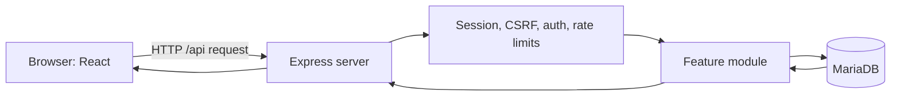
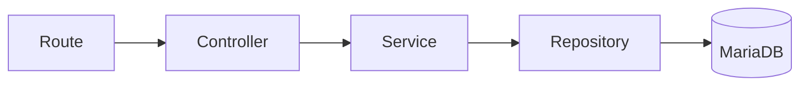

# OMDN Codebase Guide for Junior Developers

This document explains what the OMDN application currently does, how its pieces work together, and where to look when something goes wrong. It describes the code that exists now. Planned changes are called out separately.

## 1. The application in one minute

OMDN is one application with three main parts:

1. A React frontend runs in the browser and displays pages.
2. An Express backend receives API requests, applies security rules, and runs application logic.
3. MariaDB permanently stores users, sessions, permissions, security tokens, rate limits, and audit events.

During development, two processes run:

- Vite serves the React application on port `5173` and forwards `/api` requests to Express.
- Express serves the API on port `3000`.

In production, `npm start` first builds React Router's SPA output into `build/client`. Express then serves both the built frontend and the API from one process.



## 2. What is implemented and what is not

Currently implemented:

- Basic registration, email verification, login, logout, and admin pages
- Server-side sessions stored in MariaDB
- Roles and permissions
- Password recovery and password changes on the backend
- TOTP setup, QR-code generation, login verification, recovery codes, and disabling TOTP on the backend
- CSRF protection
- Persistent rate limiting
- Authentication audit events and an outbox worker
- Soft account deletion and permanent cleanup after one year
- Unit, integration, browser, and real-database smoke tests

Not yet implemented as a complete user interface:

- TOTP screens
- Password recovery and account management screens
- The blog/post system
- Dedicated Framework route modules and server-side rendering (SSR)
- The final design system

The files under `src/components/ui/` are an offline shadcn reference library. They are not the final UI architecture and do not need to influence current backend work.

## 3. Important folders

| Path                 | Responsibility                                 |
| -------------------- | ---------------------------------------------- |
| `src/`               | Code that runs in the browser                  |
| `src/pages/`         | Page components such as login and registration |
| `src/api/`           | Browser-to-backend API calls                   |
| `src/router/`        | Current client-side URL routing                |
| `src/components/ui/` | Offline shadcn reference components            |
| `server/`            | Code that runs in Node.js                      |
| `server/modules/`    | Business features grouped by domain            |
| `server/middleware/` | Rules applied to many requests                 |
| `server/database/`   | SQL migrations and seed data                   |
| `scripts/dev/`       | Maintenance, diagram, and smoke-test scripts   |
| `tests/e2e/`         | Playwright browser tests                       |
| `docs/`              | Architecture decisions and generated diagrams  |

Frontend imports beginning with `@/` point to `src/`. Backend imports beginning with `#server/` point to `server/`.

## 4. How the server starts

The entry point is `server/server.js`.

It performs these steps in order:

1. `serverConfig.js` reads and validates environment variables with Zod.
2. `createPool.js` creates the MariaDB connection pool.
3. `expressApp.js` creates and connects the Express application.
4. The authentication-event worker starts.
5. The deleted-account cleanup worker starts.
6. Express starts listening on the configured port.
7. Shutdown handlers are registered for `SIGINT` and `SIGTERM`.

The program refuses to start if required configuration is missing or invalid. This is intentional: discovering a bad secret or database setting during startup is safer than discovering it during a real request.

When the process stops, `server/shutdown.js`:

1. Stops accepting HTTP traffic.
2. Drains pending audit-event writes.
3. Stops both background workers.
4. Closes the session store.
5. Closes the database pool.

An eight-second deadline prevents a broken dependency from keeping the process alive forever.

## 5. The Express request pipeline

Middleware is code that runs before or after a route handler. Its order matters. `server/expressApp.js` installs the main pipeline in this order:

1. Add a correlation ID to `/api` requests.
2. Parse JSON request bodies.
3. Configure proxy trust in production.
4. Load the session from MariaDB.
5. Require CSRF protection for unsafe `/api` methods.
6. Mount authentication routes.
7. Mount account routes behind authentication.
8. Mount admin routes behind authentication and permission checks.
9. Mount generic API routes and the API 404 response.
10. Handle unexpected API errors.
11. In production, serve the built React application.

A request can stop at any layer. For example, an admin request with no session returns `401` before it reaches the admin controller.

### Correlation IDs

Each API request receives an `x-correlation-id`. Unexpected errors are logged with that ID, and the response returns the same ID. A user can report the ID without seeing internal error details.

### Common HTTP statuses

| Status | Meaning in this application                                                   |
| ------ | ----------------------------------------------------------------------------- |
| `200`  | The operation completed                                                       |
| `202`  | The request was accepted, but another step is required or deliberately hidden |
| `400`  | The submitted data or token is invalid                                        |
| `401`  | The caller is not authenticated                                               |
| `403`  | The caller is known but not allowed, or a security check failed               |
| `404`  | The API route does not exist                                                  |
| `429`  | Too many attempts were made                                                   |
| `500`  | An unexpected server error occurred                                           |

## 6. Sessions: how login remains remembered

The browser receives a cookie named `omdn_session`. The cookie contains a signed, opaque session identifier—not the user object, roles, or permissions.

The matching session data is stored in MariaDB's `sessions` table. After login, it contains a `userId`. The session expires after seven days.

Cookie security settings:

- `HttpOnly`: browser JavaScript cannot read the session cookie.
- `SameSite=Lax`: reduces cross-site cookie sending.
- `Secure` in production: the browser sends it only over HTTPS.
- Signed with `SESSION_SECRET`: tampering invalidates it.

MariaDB remains authoritative. A session cookie alone is not enough: protected requests use `requireAuth`, which loads the current user, roles, and permissions from the database. This means a disabled user or changed permission takes effect without waiting for the session to expire.

This database check has a cost, but it prevents stale authorization. A future cache can reduce repeated work, provided invalidation remains correct.

## 7. CSRF protection

CSRF means another website tricks a logged-in browser into sending an unwanted request. Cookies are attached automatically by browsers, so the session cookie alone cannot prove that the OMDN frontend created a request.

For every state-changing API method (`POST`, `PUT`, `PATCH`, or `DELETE`):

1. The frontend calls `GET /api/auth/csrf` if it has no cached token.
2. Express creates a random token and stores it inside the current session.
3. The frontend sends the token in `X-CSRF-Token`.
4. Express compares the supplied and stored tokens using a timing-safe comparison.
5. Express also evaluates browser source information (`Sec-Fetch-Site`, `Origin`, and `Referer`).
6. A missing, invalid, or cross-site request receives `403` and `CSRF_TOKEN_INVALID`.

`src/api/authApi.js` performs this automatically. If the session changes and a cached token becomes stale, it fetches a fresh token and retries once.

Do not call an unsafe endpoint directly with `fetch` unless you deliberately reproduce this behavior. Prefer the shared API client.

## 8. Backend architecture: route, controller, service, repository

Most features use four layers:



- **Route:** declares the URL, HTTP method, middleware, and controller.
- **Controller:** translates HTTP input into a service call and the result into an HTTP response.
- **Service:** contains business rules and coordinates a use case.
- **Repository:** contains SQL and database-specific behavior.
- **Module:** constructs these pieces and supplies their dependencies.

For example, registration is assembled by `registrationModule.js`, exposed by `registrationRoutes.js`, translated by `registerController.js`, decided by `registerService.js`, and stored through `registrationRepository.js`.

This separation makes business logic testable without running the entire server. It also avoids placing SQL, HTTP details, and business decisions in one large function.

### Dependency injection

Services receive repositories and helpers as arguments rather than importing a global database. This is called dependency injection. Tests can supply small fake dependencies, and production supplies real ones in each `*Module.js` file.

### Transactions

A database transaction makes several related changes succeed or fail as one unit.

Typical structure:

```js
await connection.beginTransaction();

try {
	// related database writes
	await connection.commit();
} catch (error) {
	await connection.rollback();
	throw error;
}
```

All repository calls in that transaction must use the same connection. `withConnection.js` obtains and releases it safely.

## 9. Authentication flows

### Registration and email verification

Registration:

1. CSRF and registration rate-limit middleware run.
2. Zod validates the display name, email, and password.
3. The service checks whether the normalized email already exists.
4. Argon2id hashes the password. Plain-text passwords are never stored.
5. A random verification token is created.
6. Only the token's SHA-256 hash is stored.
7. In one transaction, a pending user is created, the subscriber role is assigned, and the verification record is stored.
8. The API returns a deliberately generic `202` response so account existence is harder to discover.

The raw verification token is currently printed only in development because email delivery has not been connected.

Verification hashes the submitted token, locks and checks the database record, activates the user, marks verification tokens used, and commits everything together.

### Login without TOTP

1. The login rate limiter runs.
2. The service finds the identity by normalized email.
3. Argon2 verifies the password hash.
4. Pending, disabled, and deleted accounts are rejected.
5. If TOTP is disabled, the session is regenerated to prevent session fixation.
6. `userId` is stored in the new session.
7. Other sessions belonging to that user are removed.
8. `last_login_at` is updated.

The current policy allows one authenticated session per user. A new successful login revokes older sessions.

### Login with TOTP

After a correct password, an account with TOTP enabled is not fully authenticated. The server stores temporary pending-login state in the session and returns `202`.

The client must then submit a six-digit TOTP or recovery code to `/api/auth/totp/login/verify`. A valid second factor completes the session. TOTP time steps are recorded so the same time-based code cannot be replayed. Recovery codes are hashed in the database and are single-use.

The backend flow exists, but the dedicated frontend TOTP screen is still pending.

### TOTP setup

1. The backend generates an authenticator secret.
2. It creates an `otpauth://` URI for “O Melhor do Natal”.
3. `qrcode` converts the URI into a QR-code data URL.
4. The secret is encrypted with AES-256-GCM before storage.
5. Encryption binds the secret to the user ID through additional authenticated data.
6. The user scans the QR code and submits the current code.
7. Successful verification enables TOTP and returns new recovery codes once.

`TOTP_ENCRYPTION_KEY` must be a Base64 encoding of exactly 32 random bytes. It must not be exposed through a `VITE_*` variable.

### Password recovery and change

Forgot-password responses do not reveal whether an email exists. Reset tokens are random; only their hashes are stored. A successful reset changes the password, consumes reset tokens, and deletes all existing sessions in one transaction.

An authenticated password change verifies the current password, updates the hash, regenerates the current session, and revokes all other sessions.

### Logout

Logout destroys the server-side session and clears the browser cookie. The frontend also forgets its cached CSRF token.

## 10. Authentication versus authorization

These words are related but different:

- **Authentication:** “Who are you?” Answered by the session and `requireAuth`.
- **Authorization:** “May you do this?” Answered by roles, permissions, and `requirePermission`.

Roles group permissions. Users receive roles through `user_roles`; roles receive permissions through `role_permissions`. The admin test endpoint requires `users.manage` rather than checking for a hard-coded role name. Permission checks are more flexible because several roles can eventually share a capability.

The frontend checks permissions to decide where to navigate and what to display. This is only a user-experience decision. The backend always checks permissions again because users can bypass frontend code and call an API directly.

## 11. Why `/me` exists

`GET /api/account/me` returns the current user, roles, and permissions from the authoritative backend.

The current mockup uses it in two places:

- Login calls `/me` after success to decide whether to navigate to `/admin`.
- Admin calls `/me` again when mounted to protect direct navigation or page refresh.

React development `StrictMode` may mount effects twice, and browser caching can turn repeated successful GETs into `304` responses. That explains why development tools can show multiple `/me` calls. This mockup behavior was accepted temporarily. A future application-level auth provider or React Router loader can load identity once and share it while the backend remains the security authority.

## 12. Frontend flow

`src/root.jsx` now owns the HTML document in React Router Framework SPA Mode. A temporary Framework catch-all route renders the existing `AppRoutes.jsx` tree, which still maps browser URLs to page components. The previous `index.html` and `src/main.jsx` bootstrap files remain only until the migration cleanup step.

The current frontend is a client-rendered single-page application:

- The browser receives a small HTML shell.
- JavaScript loads.
- React selects and renders the page.
- Pages call the Express API when they need server data.

It now uses React Router Framework tooling with `ssr: false`, but its individual pages have not yet been converted to Framework route modules. It is not SSR. Later phases will render public SEO-sensitive pages on the server while Express remains the outer HTTP server.

### Current page behavior

- `/register` manages form state and displays server validation errors.
- `/verify-email?token=...` submits the verification token once.
- `/login` logs in, calls `/me`, and navigates administrators to `/admin`.
- `/admin` verifies the session and permission, calls the protected admin endpoint, and supports logout.
- `/dev/design-system` exists only in development.

The `active` flag in `AdminPage` prevents an asynchronous request from updating state after the component unmounts. The `verificationStarted` ref prevents React StrictMode from submitting an email token twice during development.

## 13. Rate limiting

Sensitive operations limit repeated attempts. Counters are stored in MariaDB rather than memory, so they survive restarts and work across multiple application instances.

Different operations use different keys:

- Login combines IP address and normalized email.
- TOTP login combines IP address and session ID.
- Password reset uses separate IP and token counters.
- Authenticated critical actions use separate IP and user counters.

Counter keys are hashed before storage. The limiter fails closed if its database store fails: a security-sensitive request is rejected instead of silently becoming unlimited.

Some limiters skip successful requests. This means normal successful use does not consume the failure allowance.

## 14. Audit events and the outbox worker

Authentication outcomes need a durable audit trail. Writing directly to the final audit table after sending a response can lose events if the process crashes. Writing it before every response can make users wait or cause the main action to fail for an unrelated audit-delivery problem.

The project uses an outbox:

1. Request middleware records an event in `auth_event_outbox`.
2. The background worker claims pending rows in batches.
3. It writes them to `auth_events`.
4. It marks outbox rows processed and clears copied sensitive payload data.
5. Failed delivery is retried with increasing delays.

Unique outbox IDs prevent duplicate final events. Stale claims can be recovered if a worker crashes.

## 15. Account deletion and retention

Deleting an account currently performs a soft delete:

1. Password is verified.
2. TOTP or a recovery code is also required if TOTP is enabled.
3. Short-lived authentication data is deleted.
4. The user is marked deleted and can no longer authenticate. The core user row is retained during the one-year soft-delete period.
5. Active sessions are removed.

The cleanup worker runs immediately at startup and then daily. It permanently removes soft-deleted users whose `deleted_at` is at least one year old, in batches of 100. Related records are removed explicitly or through foreign-key cascades.

## 16. Main database tables

| Table                            | Purpose                                |
| -------------------------------- | -------------------------------------- |
| `users`                          | Core account state and profile fields  |
| `auth_identities`                | Login identity and password hash       |
| `roles`, `permissions`           | Available authorization definitions    |
| `user_roles`, `role_permissions` | Many-to-many authorization links       |
| `sessions`                       | Server-side browser sessions           |
| `email_verification_tokens`      | Hashed, expiring verification tokens   |
| `password_reset_tokens`          | Hashed, expiring reset tokens          |
| `user_totp`                      | Encrypted authenticator configuration  |
| `user_recovery_codes`            | Hashed single-use recovery codes       |
| `rate_limit_counters`            | Shared persistent attempt counters     |
| `auth_event_outbox`              | Audit events waiting for delivery      |
| `auth_events`                    | Delivered authentication audit history |

Migrations must be applied in numeric order. Seeds then create the initial roles and permissions. There is currently no automated migration command.

## 17. Testing strategy

The project has several test levels because each catches different failures.

| Level                        | Tool               | What it proves                                                                         |
| ---------------------------- | ------------------ | -------------------------------------------------------------------------------------- |
| Unit/service                 | Vitest             | Business decisions work with controlled dependencies                                   |
| Route/middleware integration | Vitest + Supertest | HTTP status, middleware, sessions, and response shapes work                            |
| Browser end-to-end           | Playwright         | React, Vite proxying, cookies, CSRF, and Express work together                         |
| Real authentication smoke    | Custom Node script | The complete authentication system works with real MariaDB tables and survives restart |

Useful commands:

```bash
npm test
npm run test:e2e
npm run smoke:auth
npm run lint
npm run build
```

The Playwright suite uses a separate database ending in `_playwright`. The smoke test creates a temporary real user and cleans it up. Never point tests at irreplaceable production data.

## 18. How to trace a request

When debugging, follow the request in this order:

1. Find the frontend call in `src/api/` or the page.
2. Find the matching route under `server/modules/.../*Routes.js`.
3. Read route middleware from left to right.
4. Open the controller passed to that route.
5. Open the service called by the controller.
6. Open the repository methods used by the service.
7. Check the relevant migration for table definitions and constraints.
8. Find the colocated `*.test.js` file for expected behavior.

For an unexpected `500`, use the response correlation ID to find the matching server log. For `401`, inspect session and authentication. For `403`, inspect permission and CSRF rules. For `429`, inspect the relevant rate limiter.

## 19. How to add a backend feature safely

For a typical new use case:

1. Define the route and who may access it.
2. Define and validate the request schema.
3. Write a service describing the business rules.
4. Add repository methods for required SQL.
5. Use a transaction when several writes must remain consistent.
6. Create a controller translating results into stable HTTP responses.
7. Wire dependencies in the feature module.
8. Add focused service and route tests.
9. Add the call to the shared frontend API layer.
10. Add browser or smoke coverage when the flow crosses important boundaries.
11. Update documentation and diagrams when architecture changes.

Never rely on a hidden frontend button as authorization. Never store a plain password, verification token, reset token, recovery code, or TOTP secret.

## 20. Development and production differences

| Development                                    | Production                                                         |
| ---------------------------------------------- | ------------------------------------------------------------------ |
| Vite and Express run separately                | Express serves the built frontend and API                          |
| Vite proxies `/api`                            | Requests reach Express directly or through the hosting proxy       |
| Verification/reset tokens print to the console | Tokens must be delivered through a real email provider             |
| Session cookies may use HTTP                   | Session cookies require HTTPS                                      |
| React StrictMode helps expose unsafe effects   | Production does not perform StrictMode's development remount check |
| Design-system reference route is available     | Development-only route is excluded                                 |

## 21. Important security rules to preserve

- Keep secrets server-side and outside Git.
- Never use `VITE_*` for private values; Vite bundles them into browser code.
- Validate all external input on the backend.
- Continue using Argon2id for passwords.
- Store hashes of disposable tokens, not their raw values.
- Keep TOTP secrets encrypted at rest.
- Regenerate sessions after authentication and password changes.
- Require CSRF tokens for every unsafe API request.
- Check permissions on the backend.
- Use parameterized SQL instead of building SQL from user strings.
- Revoke sessions after password reset, account deletion, or a new login when required by policy.
- Do not expose internal exceptions in API responses.
- Keep rate limits and security tests when refactoring routes.

## 22. Glossary

| Term                 | Plain-language meaning                                                           |
| -------------------- | -------------------------------------------------------------------------------- |
| API                  | The HTTP interface used by the frontend to ask the backend for work              |
| Middleware           | A function that inspects or changes a request before the final handler           |
| Session              | Server-side data that remembers a browser across requests                        |
| Cookie               | A small browser value automatically sent with matching requests                  |
| Authentication       | Proving who a user is                                                            |
| Authorization        | Deciding what that user may do                                                   |
| CSRF                 | A cross-site attempt to make a logged-in browser perform an unwanted action      |
| TOTP                 | A short-lived authenticator-app code based on a shared secret and current time   |
| Hash                 | A one-way representation used for comparison without storing the original secret |
| Encryption           | Reversible protection using a secret key                                         |
| Transaction          | A group of database operations that commit or roll back together                 |
| Repository           | Code responsible for persistence and SQL                                         |
| Dependency injection | Passing dependencies into code instead of creating hidden globals                |
| Outbox               | A durable queue table used to deliver events reliably                            |
| Worker               | Background code that repeatedly processes queued or scheduled work               |
| SPA                  | A browser application that changes pages using JavaScript without full reloads   |
| SSR                  | Rendering page HTML on the server before sending it to the browser               |

## 23. Recommended learning order

Do not try to understand every file at once. Use this order:

1. `src/pages/RegisterPage.jsx`
2. `src/api/authApi.js`
3. `server/expressApp.js`
4. Registration route, controller, service, and repository
5. `sessionMiddleware.js` and `requireAuth.js`
6. Login route, controller, and service
7. `csrfMiddleware.js`
8. Account `/me` and admin permission checks
9. TOTP services
10. Rate-limit storage and authentication-event outbox
11. Deleted-account cleanup and graceful shutdown

Read the relevant test beside each feature. Tests often provide the clearest examples of what inputs are accepted and what result is expected.

## Final mental model

The browser is responsible for presentation and user interaction. Express is responsible for trust decisions and business rules. MariaDB is responsible for durable truth. The frontend may hide a link or cache data for speed, but the backend must still validate the session, CSRF token, input, account state, and permission before changing anything.

When you are unsure where logic belongs, ask: “Would this rule still need to be enforced if someone skipped the React application and called the API directly?” If yes, it belongs on the backend.
